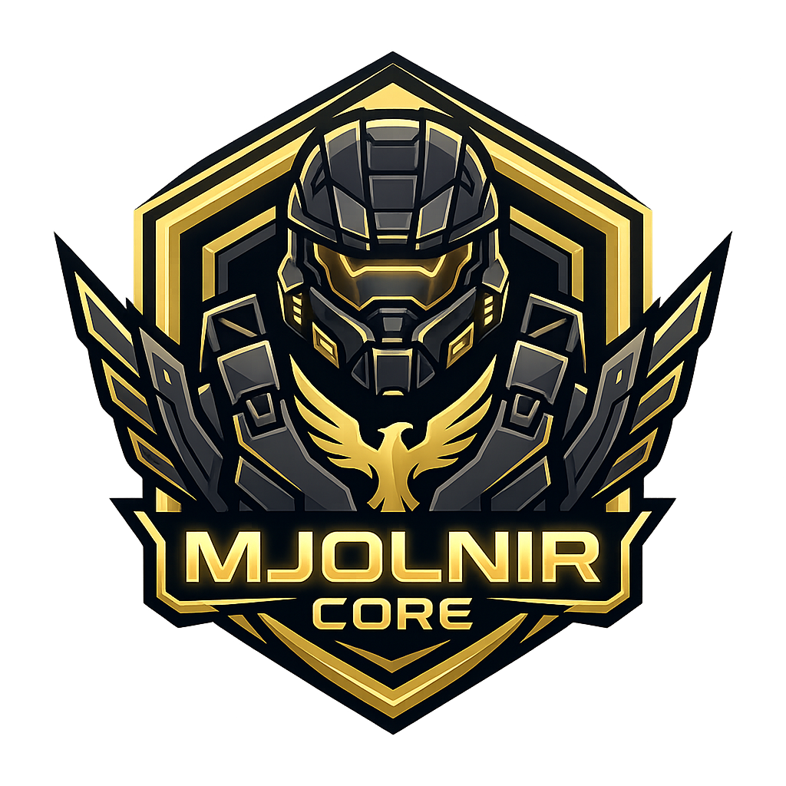

<p align="center">
  <a href="https://mjolnircore.com">
    
  </a>
</p>

<h1 align="center">MJOLNIR Core</h1>

<p align="center">
  <strong>The Open-Source Modding Framework & Platform for Halo Campaign Evolved</strong>
</p>

<p align="center">
  <a href="https://github.com/devnull9090/mjolnir-core/actions/workflows/ci.yml"></a>
  <a href="https://github.com/devnull9090/mjolnir-core/actions/workflows/deploy-hub.yml"></a>
  <a href="https://github.com/devnull9090/mjolnir-core/blob/main/LICENSE"></a>
  <a href="https://discord.gg/9gxYZsByW9"></a>
  <a href="https://store.steampowered.com/app/2806050/Halo_Campaign_Evolved/"></a>
  <a href="https://www.unrealengine.com/"></a>
  <a href="https://mjolnircore.com"></a>
  <a href="https://tauri.app"></a>
</p>

<p align="center">
  🌐 <a href="https://mjolnircore.com"><strong>mjolnircore.com</strong></a> · 💬 <a href="https://discord.gg/9gxYZsByW9"><strong>Join Discord</strong></a> · 📦 <a href="https://mjolnircore.com/download"><strong>Download Launcher</strong></a>
</p>

---

## Repository Structure

```
mjolnir-core/
├── mods/                        # UE4SS Lua mods
│   ├── MJOLNIRCore/             # Core runtime & UEHelpers library
│   ├── MJOLNIRFlyCam/           # Free debug camera on the numpad, mouse look, HUD toggle
│   ├── MJOLNIRConsoleEnabler/   # Developer console enabler (~ / Tab / F10)
│   ├── MJOLNIRMultiplayer/      # Experimental map travel & admin commands
│   ├── MJOLNIRDiscovery/        # UFunction dumper & travel logging
│   ├── MJOLNIRTagProbe/         # Read loaded Blam tag assets in game
│   └── MJOLNIRBridge/           # Remote control: run Lua & console commands from outside
├── signatures/                  # UE4SS AOB scan overrides for HCE
├── native/                      # C source for FName trampoline DLL
├── config/                      # Reference UE4SS-settings.ini + CU3 build lock
├── runtime/                     # Pinned UE4SS runtime bundle inputs (ue4ss.lock.json)
├── keys/                        # Public release-signing keys
├── defs/                        # Exported tag definition corpus (schema only)
├── changelog/                   # Public release notes, one file per tagged release
├── docs/                        # Format findings and guides
├── tools/ghidra/                # Ghidra reverse-engineering scripts
├── tools/iostore/               # UE5 IoStore + Blam tag readers (Python)
├── tools/pe/                    # PE/binary inspection, AOB signature checker
├── tools/mcp/game/              # Launch, drive and screenshot the game (MCP server + CLI)
├── crates/                      # Rust workspace
│   ├── ue-iostore/              # UE5 .utoc/.ucas + .pak reader, TOC writer, container packer
│   ├── blam-defs/               # Tag definition model & JSON corpus loader
│   ├── blam-tag/                # Blam tag reader, writer and editor
│   ├── blam-hsc/                # Blam script: expression tree, decompiler, compiler, opcode table
│   ├── blam-pack/               # Bake edited tags into `_P` override containers
│   ├── blam-live/               # Read and patch tag payloads in the running game
│   ├── mjolnir-sign/            # Ed25519 author signatures for .mjolnir archives
│   └── blam-cli/                # `mjolnir` command-line tool
├── apps/
│   ├── launcher/                # Tauri desktop mod manager
│   └── tag-editor/              # Guerilla-style tag, texture, audio and script browser and editor
└── hub/                         # Cloudflare mod community platform
```

---

## Mods

### MJOLNIRFlyCam
Free-flying detached camera on the numpad, with mouse look, speed boost, and automatic
first-person model hiding. Camera keys live on the numpad because the game's Blam
simulation reads WASD/mouse directly — the player keeps responding to those even while
the camera is detached.

| Hotkey | Action |
| :--- | :--- |
| `F8` | Toggle FlyCam ON/OFF (auto-hides HUD and the floating first-person arms/gun) |
| `F7` | Toggle HUD overlay |
| `F9` / `Numpad 0` | Toggle mouse look |
| `Numpad 8/2` | Move camera forward / backward |
| `Numpad 4/6` | Strafe camera left / right |
| `Numpad 9/3` | Ascend / Descend |
| `Numpad 5` | Snap camera back to the player |
| `Left Shift` | Boost speed (3x) |
| `Numpad +/-` or `[ / ]` | Increase / Decrease base speed |

### MJOLNIRConsoleEnabler
Enables the UE5 developer console in the shipping build.

### MJOLNIRMultiplayer
Experimental travel probes for verified campaign package paths, listen-server loading, and player
administration. Runtime travel and session preservation still require in-game verification.

| Command | Purpose |
| :--- | :--- |
| `mjolnir_maps` | List verified CU3 root world package keys and paths |
| `mjolnir_kick <name>` | Send a player the kick notice (see caveat below) |
| `mjolnir_travel a15` | Dispatch plain travel to the A15 campaign world |
| `mjolnir_listen a15` | Dispatch travel to A15 with `?listen` |
| `mjolnir_scan_blam` | Dump live BlamEngine classes, functions, and candidate instances |
| `mjolnir_scan_worlds` | Dump loaded Halo world objects |
| `mjolnir_trace_network` | Hook co-op session, lobby, and travel lifecycle functions |
| `mjolnir_dump_state` | Snapshot live variant and Blam network component properties |

### MJOLNIRTagProbe
Reads loaded Blam tag assets from inside the running game, so an override container can be checked
against what the game actually loaded rather than against inference.

| Command | Purpose |
| :--- | :--- |
| `mjolnir_tag_classes` | List which `Blam*TagDataAsset` classes are loaded |
| `mjolnir_tag_probe [filter]` | Dump loaded tag assets and their properties |
| `mjolnir_paks` | Report what the mounted file tree can see |

### MJOLNIRBridge
Turns the running game into something a tool can drive: it watches a request file and runs console
commands or arbitrary Lua on the game thread, answering back. Paired with `tools/mcp/game`, that
gives launch, level load, live state reads, input and screenshots without a person at the keyboard.
Install with `scripts/install-bridge.ps1`; see
[`docs/game_automation.md`](docs/game_automation.md).

> **`mjolnir_kick` notifies, it does not disconnect.** `AGameSession::KickPlayer` is a plain
> C++ virtual with no `UFUNCTION` macro, so it is absent from Unreal's reflection tables and
> unreachable from UE4SS — the call raises "attempt to call a TrivialObject value". The only
> kick-shaped reflected function in the build is `PlayerController:ClientWasKicked`, so the
> command sends that and leaves the disconnect to the client. It is not enforcement.

### MJOLNIRCore
Core framework initialization and `UEHelpers` utility library.

> **A mod that calls a MJOLNIR-only helper must ship its own `Scripts/UEHelpers.lua`.**
> `require("UEHelpers")` searches the mod's own `Scripts/` first and UE4SS's `Mods/shared/`
> second. Without a local copy it silently binds to upstream's UEHelpers, which has no
> `SafeGetPlayerName`, `FindObjectSafe`, `GetAllPlayerControllers` or `GetGameSession` — and
> the failure surfaces as a nil call at the first use, not at load.

---

## Quick Start

### Prerequisites
- [Halo Campaign Evolved](https://store.steampowered.com/app/2806050/Halo_Campaign_Evolved/) (Steam)
- [RE-UE4SS v3.0.1 experimental](https://github.com/UE4SS-RE/RE-UE4SS/releases) (`dwmapi.dll` proxy)

### Installation
1. Install UE4SS into `Meteorite/Binaries/Win64/ue4ss/`
2. Copy the `mods/` folder contents into `ue4ss/Mods/`
3. Copy the `signatures/` folder contents into `ue4ss/UE4SS_Signatures/`
4. Copy `config/UE4SS-settings.ini` to `ue4ss/UE4SS-settings.ini`
5. Add mod entries to `ue4ss/Mods/mods.txt`:
   ```
   MJOLNIRCore : 1
   MJOLNIRConsoleEnabler : 1
   MJOLNIRFlyCam : 1
   ```
6. Launch the game via Steam

### Reloading Mods
UE4SS reads `mods.txt` and loads Lua scripts during process startup in the tested configuration.
Restart HCE after adding, enabling, or changing a mod; MJOLNIR Core does not currently install a
`CTRL+R` reload binding.

---

## Development

### After a Game Update

The game updates without asking, and two things break quietly when it does: the AOB signatures
UE4SS uses to find engine internals, and every offset recorded in `docs/`. Both checks are cheap,
and neither is visible in the UE4SS log.

```bash
python tools/pe/aob_scan.py "<Win64>/HaloCampaignEvolved.exe"
```

Reports `OK`, `NO MATCH`, or `AMBIGUOUS xN` per signature, and exits nonzero unless all four
resolve **uniquely**. Ambiguity is the dangerous case: UE4SS logs an address and starts fine, then
fails somewhere unrelated. See [`signatures/README.md`](signatures/README.md).

```bash
python tools/build_lock.py "<install root>" --verify config/hce-build.lock.json
```

Checks the install against the committed lock and names every file that moved. Regenerate with
`-o config/hce-build.lock.json`; `--binaries-only` skips the 74 GiB content pass. The current build
and what has been re-verified against it are in [`docs/build_lock.md`](docs/build_lock.md).

### Experimental Builds from a Pull Request

To get a change in front of testers before it ships, a maintainer comments on the pull request:

```
/experimental
```

That packages the PR's mods and attaches them to a pre-release tagged `experimental-pr<N>`, then
replies with the link. The tag moves as the PR is updated and is deleted when the PR closes, so
there is one link per PR and no clutter afterwards. `workflow_dispatch` with a PR number does the
same thing.

**Only users with write access can trigger it.** The permission is checked against the repository
rather than inferred from the commenter's relationship to it, so a `/experimental` from anyone else
is refused with a reaction and no build.

Testers install by hand — unzip over `ue4ss/`, back up what it replaces, and add any new mod to
`mods.txt`. That is the deliberate shape of it:

- **Experimental builds are unsigned**, so the launcher will not install one. The launcher pins a
  single public key and installs nothing that fails verification. The release-signing key is never
  given to a build of unreviewed pull-request code, which is what makes this safe to run on pull
  requests from forks.
- **Nothing on the auto-update path changes.** The workflow never writes `mods/latest/` and never
  touches R2 at all. No existing install changes until someone copies the files in.
- **Nothing from the pull request executes.** Script mods are Lua text and packaging them is `zip`;
  no build script and none of this repository's own `scripts/` are run from the checked-out branch.

See [`.github/workflows/experimental-build.yml`](.github/workflows/experimental-build.yml).

### Reverse Engineering
Ghidra Java scripts for the simulation factory and host loader path:
```powershell
analyzeHeadless.bat <project_dir> HaloSimulation `
  -import "HaloSimulation_tag_release.dll" `
  -scriptPath "tools/ghidra" `
  -postScript AnalyzeBlamShell.java <output_dir>

analyzeHeadless.bat <project_dir> HCE_Analysis `
  -process "HaloCampaignEvolved.exe" `
  -noanalysis `
  -scriptPath "tools/ghidra" `
  -postScript AnalyzeBlamLoader.java <output_dir>

analyzeHeadless.bat <project_dir> HCE_Analysis `
  -process "HaloCampaignEvolved.exe" `
  -noanalysis `
  -scriptPath "tools/ghidra" `
  -postScript AnalyzeMultiplayerRuntime.java <output_dir>
```

Ghidra 12.1 does not run Python scripts through `analyzeHeadless` unless it is launched through
PyGhidra. Use the Java probes above for standard headless runs.

### Game Data Analysis
Read-only IoStore readers for the shipped `.utoc`/`.ucas` containers live in `tools/iostore`. They
need an `oo2core_9_win64.dll` from a local Unreal Engine install, since UE 5.5 statically links
Oodle and the game ships no separate DLL.

```powershell
$paks  = "<install>\Meteorite\Content\Paks"
$oodle = "<UE install>\Engine\Binaries\DotNET\AutomationTool\oo2core_9_win64.dll"

python tools/iostore/dump_index.py   --paks $paks --ext-stats --out out/iostore_paths.tsv
python tools/iostore/inspect_tags.py --paks $paks --oodle $oodle --per-group 1
python tools/iostore/zen_class.py    --paks $paks --oodle $oodle --grep-scripts "TagDataAsset$"
python tools/iostore/extract_tags.py --paks $paks --oodle $oodle --group vehicle --out <dir> --verify
```

`extract_tags.py` output is copyrighted game content. Keep it local and never commit it.
See [`docs/tag_data_pipeline.md`](docs/tag_data_pipeline.md) for the findings these tools produced.

### Tag Definitions

Halo Campaign Evolved tag files are **self-describing**: each one carries a `blay` layout section
holding its own field names, type names, and enum option names — the same strings Guerilla showed.
Definitions for all 101 shipped groups are recoverable from the game data alone, with no need to
recover them from the engine binary. See [`docs/tag_body_format.md`](docs/tag_body_format.md), and
[`docs/tag_editing_guide.md`](docs/tag_editing_guide.md) for a practical guide to reading and
editing tags with the CLI and the editor.

The Rust workspace in `crates/` reads containers and layouts natively:

| Crate | Purpose |
|---|---|
| `ue-iostore` | UE 5.5 IoStore `.utoc`/`.ucas` reader (TOC v2–8, built-in Oodle decoder, zlib, partitions), the `.pak` reader the audio lives behind, and the container packer |
| `blam-defs` | Shared tag definition model and JSON corpus format |
| `blam-tag` | Container header, `blay` layout, `bdat` values: read, decode, edit, write |
| `blam-pack` | The one implementation of "patched tag bytes → a `_P` container the game loads", shared by the CLI and the tag editor |
| `blam-live` | Reading and patching a tag payload inside the *running* game, no rebuild or restart |
| `mjolnir-sign` | Ed25519 author signatures for `.mjolnir` archives — the editor signs, the launcher and CLI verify, the hub mirrors it in TypeScript |
| `blam-cli` | The `mjolnir` command-line tool |

```powershell
$env:HCE_PAKS = "<install>\Meteorite\Content\Paks"
# Optional. A decoder is built in; a DLL is only about four times faster.
$env:OODLE    = "<UE install>\Engine\Binaries\DotNET\AutomationTool\oo2core_9_win64.dll"

cargo run --release -p blam-cli -- groups                            # every group + tables
cargo run --release -p blam-cli -- list --group weapon               # every tag in a group
cargo run --release -p blam-cli -- fields --group weapon             # resolved field list
cargo run --release -p blam-cli -- layout --group camera_track --tables
cargo run --release -p blam-cli -- types                             # field type vocabulary
cargo run --release -p blam-cli -- validate --all                    # invariants, all 12,290 tags
cargo run --release -p blam-cli -- sections                          # tgly tables + blay preamble
cargo run --release -p blam-cli -- data --group weapon --trace       # decode one tag's values
cargo run --release -p blam-cli -- values --group weapon             # fields with decoded values
cargo run --release -p blam-cli -- roundtrip --all                   # re-serialise, compare bytes
cargo run --release -p blam-cli -- recode --all                      # decode/encode identity
cargo run --release -p blam-cli -- toc-roundtrip                     # rewrite every .utoc, compare bytes
cargo run --release -p blam-cli -- chunk --path assault_rifle-weapon.uasset   # hexdump any chunk
cargo run --release -p blam-cli -- pack --group weapon --tag assault_rifle-weapon --set "magazines[0].rounds loaded maximum=200" --out-dir mod
cargo run --release -p blam-cli -- set --group camera_track --field "control points[0].position" --value "(1,2,3)"
cargo run --release -p blam-cli -- tag-file --file ar.tag --field "magazines[0].rounds reloaded" --value 99 --out ar2.tag
cargo run --release -p blam-cli -- poke --group biped --tag spartans --field "jump velocity" --value 25
cargo run --release -p blam-cli -- defs                              # export the corpus
```

`tag-file` works on a tag payload already on disk, without the paks. `poke` changes a field in
the **running game** — no rebuild, no restart, nothing written to disk; see
[`docs/tag_editing_guide.md`](docs/tag_editing_guide.md).

`mjolnir validate --all` passes every structural invariant across all **12,290 shipped tags**,
resolves a root struct size for **100%** of them, and decodes the field values of **99.9%** into a
byte-exact value tree. `mjolnir roundtrip --all` then writes every one of those trees back out
and confirms **12,281 / 12,281** reproduce the original bytes exactly, across 5.77 GB.
`mjolnir defs` writes
`defs/hce/tag-definitions.json` — 101 groups, 1,779 structs, 13,250 fields — which the hub renders
as a searchable reference at [`/docs/tags`](https://mjolnircore.com/docs/tags).

Only schema is exported: field names, types, offsets, and enum option names. Tag values are game
content and are never written. Nothing is written to disk by the inspection commands.

The launcher is excluded from the root Cargo workspace on purpose, so it keeps its own target
directory and release pipeline. Build it from `apps/launcher` as before.

### Tag Editor

`apps/tag-editor` is a Guerilla-style tag, texture, audio and script browser and editor built on
the same stack as the launcher: Tauri 2, React 19, Vite, and Tailwind 4. It reads assets from your own
installation — nothing is bundled, and nothing shipped is ever modified.

Most people should install it from the **launcher's Tools tab**, which keeps it updated. To build
it from source:

```powershell
cd apps/tag-editor
pnpm install
pnpm tauri dev
```

The Paks folder is auto-detected on first run, with a manual picker as a fallback. No Oodle DLL is
required — one is used if found, purely for speed.

It renders the tag tree and, for each tag, its fields with their **decoded values** — enum and
bitfield options resolved to names, tag references as group and path, colours as hex, vectors and
bounds as numbers — with blocks and arrays expanding to their elements.

Fields are editable: click a value, type a new one, press Enter. Every edit is applied to a copy,
re-parsed from scratch and re-walked before it is kept, so a value that does not fit is rejected
rather than written.

Beyond tags, it opens the three things that used to need external tools:

- **Textures** — decoded and displayed, with zoom and PNG export. Both cook paths are handled
  (virtual textures and classic mip chains); 4787 of 4844 decode, and the 57 that do not ship no
  pixel data at all. They can also be **swapped**: point a texture at a PNG from inside a mod
  project, or run `mjolnir texture swap` on the command line. Either way the image is re-encoded
  into a payload of exactly the shipped size, so the override replaces one chunk and moves no
  metadata. See [`docs/texture_swapping.md`](docs/texture_swapping.md) for the walkthrough and
  [`docs/ue_texture_format.md`](docs/ue_texture_format.md) for the format.
- **Audio** — the ~6 GB of Wwise sound in the `.pak` siblings, played in the editor, named by the
  event that plays it rather than by a bare numeric ID, and exportable as `.wem`. See
  [`docs/wwise_audio_format.md`](docs/wwise_audio_format.md).
- **Scripts** — every campaign mission is scripted in HSC, and the original source ships in the
  `scenario` tag. A mission gets a third view beside Form and Tree: the source with highlighting
  and an outline that jumps to any script or global. It is editable, and compiles back into the
  tag — writing all thirteen missions back unmodified reproduces them byte for byte. See
  [`docs/blam_script.md`](docs/blam_script.md).

Edits belong to a **mod project** — a folder of small JSON recipe files naming tags and fields
rather than byte offsets, which autosaves on every edit and survives game updates. Script rewrites
and replacement textures are stored alongside those field edits and re-applied against whatever
the player has installed whenever the project is built. From the mod panel a project can be
**tested in game** (baked into an override container and installed beside the shipped ones,
removable in one click), **exported** as a `.mjolnir` archive, and **published** to
[the hub](https://mjolnircore.com) — signed with a per-device Ed25519 key, over an account link
established by device pairing rather than by pasting a key.

Editing a tag and shipping the result **works end to end**, resizes included — verified by editing
the assault rifle to a 99-round magazine with 900 rounds in reserve and reading both off the HUD,
and by rewiring it to fire needler shards. Start with
[`docs/making_your_first_mod.md`](docs/making_your_first_mod.md) to do it from the editor, or
[`docs/getting_started.md`](docs/getting_started.md) for the same path on the command line.

**Live mode** shortens the loop further: with it on, an accepted edit is written into the running
game as well as the project and takes effect immediately — no bake, no restart. Fixed-width fields
only, and nothing reaches disk.

Exported tags, textures and audio are copyrighted game content. Keep them local; `.gitignore`
blocks `*.ubulk`.

See [`docs/tag_editing_guide.md`](docs/tag_editing_guide.md) for a walkthrough of both the editor
and the `mjolnir` command line, and [`docs/iostore_packaging.md`](docs/iostore_packaging.md) for
how the container format was worked out and what is still open.

### The Hub, and its public API

`hub/` is the mod platform at [mjolnircore.com](https://mjolnircore.com) — Next.js on Cloudflare
Workers via OpenNext, with D1, R2 and an API mounted as a Hono app under a catch-all route.

The API is **open**: reads need no authentication and CORS is `*`. It is spec-first, so the
OpenAPI 3.1 document is generated from the same Zod schemas that validate requests and can never
drift from the implementation — CI fails the build if the checked-in spec and the code disagree.

- [`/docs/api`](https://mjolnircore.com/docs/api) — the reference, rendered
- [`/api/v1/openapi.json`](https://mjolnircore.com/api/v1/openapi.json) — the spec itself, for
  third-party tools; also checked in at [`hub/public/openapi.json`](hub/public/openapi.json)

`POST /api/v1/conflicts/check` is the one worth knowing about: a content mod ships as an IoStore
`_P` container whose chunk IDs are *identical* to the tags it overrides, so "do these mods
conflict?" is an exact set intersection rather than an author's declaration. See
[`docs/hub_architecture.md`](docs/hub_architecture.md) for the design, and [`hub/README.md`](hub/README.md)
to run it locally.

### Coming Soon

Phase 4 in [`docs/hub_architecture.md`](docs/hub_architecture.md), which tracks what is live per
phase. Texture replacement used to head this list and shipped in
[tag editor 0.8.0](changelog/tag-editor/0.8.0.md).

- **Recipe distribution**: mods are *authored* as recipes today — a project names tags and fields
  rather than byte offsets — but what ships is still a baked container. Distributing the recipe
  itself, and letting each launcher bake it against its own install, is the remaining half
- **Delta content mods**: patch against the player's own install rather than replacing a whole
  chunk, and merge soft conflicts field by field
- **Collections**: shareable profiles — a list of mod references, not bytes. Local profiles are
  live in the launcher; publishing one to the hub is not built
- **Player Tracker**: multiplayer stats and leaderboards

---

## Community

- 💬 **Discord**: [https://discord.gg/9gxYZsByW9](https://discord.gg/9gxYZsByW9)
- 🐛 **Issues**: [GitHub Issues](https://github.com/devnull9090/mjolnir-core/issues)

## License

Open Source under MIT License.
