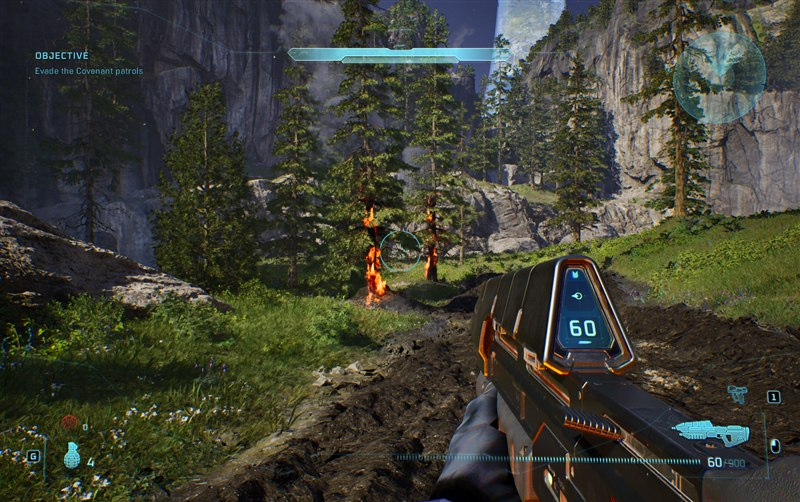
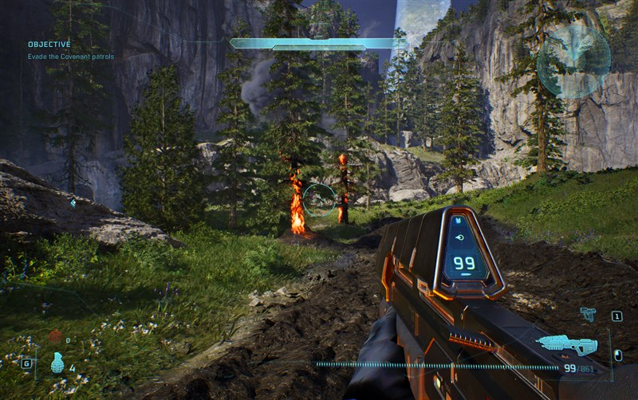
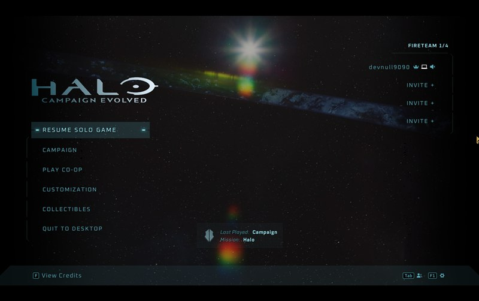

# Getting Started: Your First Tag Edit

**Goal:** change a weapon's ammunition and see it in the running game
**Time:** about an hour, most of it waiting for the game to load
**You need:** Halo Campaign Evolved on Steam (Windows), and a text editor

This walks the whole path, from a clean install to a value you changed showing up on the HUD. It
is the same route the project took to get there the first time, with the dead ends removed.

By the end you will have done this:



That 900 is not a number the shipped game contains.

---

## How the game stores its data

Worth two minutes before touching anything, because it explains why the steps are what they are.

Halo Campaign Evolved is Unreal Engine 5 wrapped around **Blam**, the original Halo engine, which
still runs the simulation. Weapons, vehicles and bipeds are **tags** — the same tag format Halo has
used since 2001 — and the UE5 side treats each one as an opaque binary blob it hands to Blam.

Those tags ship inside UE5 **IoStore containers**: a `.utoc` index paired with a `.ucas` data file,
in `Meteorite/Content/Paks`. Each tag is two **chunks**:

| Chunk type | Holds |
|---|---|
| 1 — `ExportBundleData` | the cooked UE5 package header, ~3.6 KB |
| 2 — `BulkData` | **the Blam tag itself** — the part you want to edit |

To change a weapon you replace its type-2 chunk. You do that with an **override container**: a tiny
`.utoc`/`.ucas` pair holding just your chunk, which the loader prefers over the shipped one.

The rest of this guide is the mechanics of that.

---

## Step 1 — Install the tooling

```bash
git clone https://github.com/devnull9090/mjolnir-core
cd mjolnir-core
cargo build --release -p blam-cli
```

That gives you `target/release/mjolnir`, which reads, inspects and edits tags.

Optional but recommended, since it turns a twenty-minute manual test loop into a two-minute one:

```powershell
.\scripts\install-bridge.ps1
```

That installs a UE4SS mod letting tools drive the running game — launch it, start a mission, read
values out of live objects, take screenshots. See [`game_automation.md`](game_automation.md).

---

## Step 2 — Find the tag you want

Tags are grouped by type. List the groups:

```bash
mjolnir groups --paks "<install>/Meteorite/Content/Paks" --oodle <oodle-dir>
```

then list the tags in one:

```bash
mjolnir list --paks "$PAKS" --oodle "$OODLE" --group weapon
```

Weapons live under `objects/weapons/`, so the assault rifle is
`objects/weapons/rifle/assault_rifle/assault_rifle-weapon`.

> **About `--oodle`.** The shipped containers are Oodle-compressed, so reading them needs an
> `oo2core_*_win64.dll`. This game links Oodle statically and ships no DLL, so you will need one
> from another UE5 game you own. If you do not have one, skip ahead — *Editing without Oodle* below
> covers the whole flow without it.

To see a tag's fields and current values:

```bash
mjolnir values --paks "$PAKS" --oodle "$OODLE" --group weapon --tag assault_rifle-weapon --depth 3
```

Field paths are what you saw printed, so `magazines[0].rounds loaded maximum` is a magazine's
capacity. Two ways to browse instead of reading a wall of text: the
[tag browser on the hub](https://mjolnircore.com/docs/tags), or `apps/tag-editor`, the local
Guerilla-style GUI.

---

## Step 3 — Understand the ammo fields before changing them

This is where the first attempt went wrong, so it is worth being explicit. The assault rifle's
magazine block ships as:

```
rounds total initial             = 180
rounds total maximum             = 360
rounds loaded maximum            = 60     <- magazine capacity
runtime rounds inventory maximum = 324    <- the reserve the HUD shows
rounds reloaded                  = 36     <- how many a reload transfers
```

**`rounds reloaded` is the trap.** A reload moves a fixed number of rounds into the magazine
rather than filling it. Raise `rounds loaded maximum` to 200 and leave `rounds reloaded` at 36 and
your reloads still add 36 — the magazine creeps up over several reloads and it looks like nothing
happened. Raise both and one reload gives you a clean answer.

So change these together:

| Field | To | Why |
|---|---:|---|
| `rounds loaded maximum` | 99 | magazine capacity |
| `rounds reloaded` | 99 | so one reload fills it |
| `runtime rounds inventory maximum` | 900 | the reserve on the HUD |
| `rounds total maximum` | 900 | the cap the reserve counts toward |
| `rounds total initial` | 900 | what you start with |

---

## Step 4 — Make the edit

### With the GUI

`apps/tag-editor` is a Guerilla-style browser: open a group, pick a tag, navigate to
`magazines → [0]`, change the values, and export the patched tag. Good for exploring, since you can
see field names and types without knowing the path in advance.

### With the CLI

One field per invocation, chaining the output of each into the next:

```bash
mjolnir set --paks "$PAKS" --oodle "$OODLE" \
  --group weapon --tag assault_rifle-weapon \
  --field "magazines[0].rounds loaded maximum" --value 99 \
  --out ar-1.tag
```

Every edit reports what moved:

```
  field    magazines[0].rounds loaded maximum  [short integer]
  before   60
  after    99
  file     32620 bytes, unchanged length true
  walk     7269 of 7269 bytes consumed
  differs  1 byte(s) from the original
           0x2F19: 3c -> 63
```

Read those last three lines every time. `walk … consumed` means the patched tag still parses
exactly; `differs 1 byte(s)` means the edit touched its field and nothing else. If either looks
wrong, stop.

### Editing without Oodle

If you have no Oodle DLL, work on a tag that is already a file — including the uncompressed payload
inside an override container you built earlier:

```bash
mjolnir tag-file --file ar.tag                                  # print every field
mjolnir tag-file --file ar.tag --field "magazines[0].rounds reloaded" --value 99 --out ar-2.tag
```

A tag's layout comes from its own header rather than from any external definition, so bytes on disk
are enough.

---

## Step 5 — Keep the payload the same length

**The single most important rule in this guide.**

The UE5 package header records the payload's length, and the two have to agree. Fixed-width fields
— integers, reals, enums, flags — edit **in place** and the length never changes. Strings and block
elements **resize** it, and then you also have to rewrite the package header chunk, which means a
two-chunk container and a lot more that can go wrong.

Every field in step 3 is a `short integer`, so the payload stays 32,620 bytes and you need exactly
one chunk. Confirm before continuing:

```bash
mjolnir tag-file --file ar-final.tag | head -2
```

If the byte count differs from what you started with, you changed a variable-width field. Set it
back.

---

## Step 6 — Build the override container

```bash
mjolnir pack --paks "$PAKS" --oodle "$OODLE" \
  --group weapon --tag "assault_rifle-weapon" \
  --set "magazines[0].rounds loaded maximum=99" \
  --set "magazines[0].rounds reloaded=99" \
  --set "magazines[0].runtime rounds inventory maximum=900" \
  --out-dir <somewhere>
```

`pack` reuses the chunk ID straight out of the shipped index — no ID has to be derived — then reads
its own output back through the ordinary reader before writing anything.

> **Known bug:** the perfect-hash table `pack` writes is only correct for a container holding **one
> chunk**. With more than one, the loader can silently reach only one of them. Keep your edits
> length-preserving and you stay in the safe case. See
> [`iostore_packaging.md`](iostore_packaging.md).

---

## Step 7 — Install it

Copy three files into `<install>/Meteorite/Content/Paks/`:

```
pakchunk999-MJOLNIR-Windows_P.utoc     your index
pakchunk999-MJOLNIR-Windows_P.ucas     your data
pakchunk999-MJOLNIR-Windows_P.pak      a 339-byte stub, copied from any shipped stub .pak
```

Three things about those names matter:

- **The `_P` suffix is required.** It is UE's patch-container convention, and without it the shipped
  chunk wins. This was the single hardest thing to find.
- **The `.pak` sibling is required.** Containers without one are never discovered. Several shipped
  containers pair a 339-byte stub `.pak` with a large `.ucas`, so copying a stub is normal.
- **The number confers nothing.** `pakchunk999` is not a priority.

Nothing shipped is modified. Deleting those three files reverts the game completely, and Steam's
*Verify integrity of game files* is the backstop.

---

## Step 8 — See it work

Launch, start a mission, and look at the HUD. The reserve should read 900 immediately:


Then reload. The magazine fills to 99 in one press, and the reserve drops by exactly what it took:



99 in the magazine, 861 in reserve — 900 less the 39 it took to top up from 60. That arithmetic
working out is the confirmation: it is not a HUD quirk, the simulation is using your numbers.

With the bridge mod installed, the whole loop is scriptable:

```bash
node tools/mcp/game/cli.mjs launch
node tools/mcp/game/cli.mjs input '[{"key":"Enter"},{"wait":16000},{"key":"Enter"},{"wait":30000}]'
node tools/mcp/game/cli.mjs shot hud.png
```



---

## When it does not work

**The game loads but nothing changed.** Most likely the `_P` suffix or the stub `.pak`. Check all
three files are present and named identically apart from the extension.

**You spawn holding the pistol and cannot switch weapons.** Your tag *is* being loaded, and it is
malformed — the weapon failed to build and the game fell back. This is a useful signal, not a
mystery: the override is working and the tag is wrong. Re-run `mjolnir tag-file --file` on it and
check the walk consumes every byte.

**Ammo looks almost right but not what you set.** Re-read step 3. It is nearly always
`rounds reloaded`.

**The game crashes a couple of minutes into a load.** If you used a console `open` command to jump
straight to a level from the main menu, that is the cause — it skips the setup the campaign flow
performs. Start missions through the menus.

---

## Where to go next

- [`tag_editing_guide.md`](tag_editing_guide.md) — the editing model in depth
- [`tag_body_format.md`](tag_body_format.md) — how a tag is laid out on disk
- [`iostore_packaging.md`](iostore_packaging.md) — how the container work was proven, including
  what is still unsolved
- [`game_automation.md`](game_automation.md) — driving the game from a script

A closing caution. The evidence in this project comes from measuring the running game, not from
documentation, because there is none. Several conclusions here replaced earlier ones that were
wrong in ways that looked right at the time. If something you observe contradicts this guide,
trust what you observed and please open an issue.
