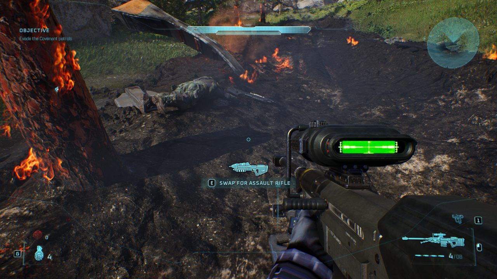

# Getting Started: Editing Halo Campaign Evolved Tags

A practical guide to reading and changing Blam tags, with the `mjolnir` command line
and the MJOLNIR Tag Editor — which also browses the game's textures and audio.

For *why* any of this works — the container format, the self-describing layout section, and
the evidence behind every rule — see [`tag_body_format.md`](tag_body_format.md). This page is
about using it.

---

## Before you start

**Read this first.** Two things are true and easy to miss:

1. **Nothing shipped is ever modified.** Every tool reads the installed containers read-only,
   and an edit produces a *new file*. Two things do write, both additive and both reversible by
   deleting files: `mjolnir pack` builds an override container you drop beside the shipped ones,
   and the editor's **Test in game** puts one there for you (**Remove test install** takes it
   back out). Steam's *Verify integrity of game files* is the backstop either way.
2. **An edit can reach the game, in one more step** — the override container above. If that is
   what you are here for, start with [`getting_started.md`](getting_started.md), which walks the
   whole path end to end, or [`making_your_first_mod.md`](making_your_first_mod.md) to do it
   without leaving the editor.
3. **Part 3 writes to the running process, not to disk.** Live mode changes a value in the
   game's memory; it survives until the game closes and touches nothing on disk.

Extracted and edited tags are **copyrighted game content**. Keep them local. The repository
ignores `*.ubulk` and `tagdump/` for this reason, and only ever publishes *schema* — field
names, types, offsets — never values.

### What you need

- Halo Campaign Evolved installed (Steam). That is all.

```powershell
$env:HCE_PAKS = "C:\Program Files (x86)\Steam\steamapps\common\Halo Campaign Evolved\Meteorite\Content\Paks"
```

```bash
# Linux: the game runs under Proton, but its files are an ordinary Steam library
export HCE_PAKS="$HOME/.steam/steam/steamapps/common/Halo Campaign Evolved/Meteorite/Content/Paks"
```

Both tools read that path, and the editor auto-detects it on first run.

The command line in Part 1 runs on Windows, Linux and macOS. The editor in
Part 2 is a Windows application today.

**Oodle is optional.** The shipped containers are Oodle-compressed and the game links Oodle
statically, so it ships no `oo2core_*_win64.dll` — but a decoder is built in and is what runs by
default. If you happen to have a DLL (any UE5 install has one under
`Engine/Binaries/DotNET/AutomationTool`), pointing at it makes decoding about four times faster
and changes nothing else; the bytes are identical either way.

```powershell
$env:OODLE = "C:\Program Files\Epic Games\UE_5.6\Engine\Binaries\DotNET\AutomationTool\oo2core_9_win64.dll"
```

---

## Part 1: the command line

```powershell
scoop bucket add mjolnir https://github.com/devnull9090/mjolnir-core   # Windows
scoop install mjolnir
```

```bash
brew tap devnull9090/core https://github.com/devnull9090/mjolnir-core  # macOS, Linux
brew install mjolnir
```

There are also `.deb` and `.rpm` packages, and a plain archive for each platform,
on the [latest release](https://github.com/devnull9090/mjolnir-core/releases?q=cli-v).
To build it from source instead — which you need only if you are changing the
tool — `cargo build --release -p blam-cli` puts the binary at
`target/release/mjolnir`.

### Finding your way around

Start wide, then narrow.

```powershell
mjolnir groups                      # all 101 groups, with counts
mjolnir list --group weapon         # every weapon tag
mjolnir list --group weapon --limit 5
```

Group names are the long ones — `weapon`, `scenario_structure_bsp`, `model_animation_graph`
— not the four-CCs.

### Looking at a tag

```powershell
mjolnir values --group weapon --tag SMG
```

That prints the tag's fields with their **actual values**: enums resolved to option names,
bitfields to the names of the bits that are set, tag references as `path (group)`, colours as
hex.

Useful flags:

| Flag | What it does |
|---|---|
| `--tag <substring>` | Pick a tag by part of its path. Without it you get the first in the group. |
| `--depth N` | How deep to print. Start at `1` for a big tag. |
| `--elements N` | How many block elements to show. Default 4. |
| `--all` | Include fields whose value is empty or zero. |

**Tip.** Big tags are enormous — `scenario` has tens of thousands of fields. Start with
`--depth 1` and work down, or pipe through `findstr` / `grep`:

```powershell
mjolnir values --group model --depth 1 | findstr "tag reference"
mjolnir values --group weapon --tag SMG --json      # the same tree as JSON, for other tools
```

To work on tags as files — the layout Blam tooling expects, `objects/weapons/rifle/smg.weapon`
— write them out:

```powershell
mjolnir extract --group weapon --out D:\kit --verify    # one group
mjolnir extract --filter characters/elite --out D:\kit  # by path
mjolnir extract --dry-run                                # what would be written
mjolnir script --tag a30 --extract D:\hsc               # a mission's .hsc source files
```

`extract` is mod-aware: a tag an installed mod overrides comes out as the mod left it, the way
the game sees it, unless `--shipped-only` asks for the game's own. What comes out is game
content — keep it local.
```

### Changing a field

```powershell
mjolnir set --group camera_track --field "control points[3].position" --value "(1.5, 2.5, 3.5)"
```

```
  field    control points[3].position  [real vector 3d]
  before   (-3.522356, 0.00095, 1.838378)
  after    (1.5, 2.5, 3.5)
  changed  12 byte(s) at 0x345..=0x350, inside the field at 0x345..0x351
  contained within the field: true
  re-read  (1.5, 2.5, 3.5)  (walk exact: true)

  dry run; pass --out <file> to write the patched tag
```

**It is a dry run unless you pass `--out`.** Read the report before writing anything. The
last line is the important one: the patched bytes were parsed again from scratch and the
value read back out of them, so it is telling you what the *file* says, not what the command
intended.

```powershell
mjolnir set --group camera_track --field "control points[3].position" `
  --value "(1.5, 2.5, 3.5)" --out my-camera_track.ubulk
```

### Field paths

A path is what you saw in `mjolnir values`, joined with dots, with `[n]` for block and array
elements:

```
bounding radius                        a field on the root
unit.object.bounding radius            through inlined structs
control points[3].position             into element 3 of a block
item.object.functions[0].export name   both
```

The editor shows the same path when you hover a field name, so you can find one in the UI and
script it on the command line.

### Writing values

Give values in the same form `mjolnir values` shows them. The quotes and brackets are
optional.

| Type | Example |
|---|---|
| integer | `--value 12` |
| real | `--value 9.25` |
| vector, bounds, colour triple | `--value "(1.5, 2.5, 3.5)"` or `--value "1.5 2.5 3.5"` |
| enum | `--value large` (by name) or `--value 3` |
| bitfield | `--value "weapon can headshot \| allows binoculars"`, or `none`, or `0x280` |
| block index | `--value 3`, or `none` for unset |
| colour | `--value "#d72a2a"` or `--value "#ffd72a2a"` |
| string | `--value "assault rifle"` |
| string id | `--value flashlight_intensity` |
| tag reference | `--value "coll:fx\holograms\hologram_01"`, or `none` |

Option names are checked against **that field's** options. Setting `secondary flags` to
`"allows binoculars"` is refused, because that option belongs to `flags` — which is a useful
guard against editing the field next to the one you meant.

### Two kinds of edit

Most fields are **fixed width**: the new value goes over the old bytes and the file is
otherwise identical. The report tells you exactly which bytes moved.

A `string id` or `tag reference` keeps its value in a trailing section, so changing it
**resizes the tag**. Those take a different path: the data section is serialised again with
the new value in place. The report says so, and shows the new file size:

```
  file     21193 bytes -> 21214 bytes (the value resizes its section)
  re-read  fx\holograms\a_longer_name (coll)
  walk     1554 of 1554 bytes consumed
```

Setting one of these to the value it already has reproduces the file **byte for byte**, which
is how you can tell the rebuild itself is not disturbing anything.

Which kind you are making matters beyond tidiness: a fixed-width edit keeps the payload the
length the game's package header declares, and that is what lets a single-chunk override
container load it. See [`getting_started.md`](getting_started.md).

### Editing a tag that is already a file

Every command above reaches its tag through the shipped containers, which means Oodle. If you
have no `oo2core` DLL, or you want to work on a tag you extracted earlier, `tag-file` takes the
bytes directly — a tag's layout comes from its own header, so nothing external is needed:

```powershell
mjolnir tag-file --file ar.tag                      # print every field
mjolnir tag-file --file ar.tag --depth 3 --all      # deeper, including zeroes
mjolnir tag-file --file ar.tag `
  --field "magazines[0].rounds reloaded" --value 99 `
  --out ar-patched.tag
```

It reports and verifies exactly as `set` does, and without `--out` it is a dry run.

### Checking your work

These run over your whole installation and are how the format claims are backed up. They are
also a good sanity check that your paths are right:

```powershell
mjolnir validate --all      # structural invariants, all 12,290 tags
mjolnir roundtrip --all     # read every tag, write it back, compare bytes
mjolnir recode --all        # decode and re-encode every field, compare bytes
```

`validate --all` takes a few minutes and reads ~5.6 GB. `roundtrip` and `recode` are slower
still. None of them writes anything.

### Digging into the format

```powershell
mjolnir fields --group weapon          # the field list, with offsets and sizes
mjolnir layout --group weapon --tables # type, block and struct tables
mjolnir sections                       # the tgly tables and the blay preamble
mjolnir data --group weapon --trace    # the value walk, section by section
mjolnir defs                           # export the whole schema corpus as JSON
```

`--trace` is the one to reach for when a tag will not read: it prints the walk as it happens
and stops at the failure, naming the field path.

---

## Part 2: the tag editor

```powershell
cd apps/tag-editor
pnpm install
pnpm tauri dev
```

On first run it looks for your installation and the Oodle DLL. If it cannot find them, point
it at the two paths above. The game field takes anything that names the install — the folder
named after the game, the Steam library holding it, the `Meteorite\Content\Paks` folder, or a
container inside it — and resolves the rest itself.

Whichever installation is open is named at the bottom of the left panel, with **change** beside
it to open a different one. Setting `MJOLNIR_GAME_DIR` picks the install for a run where nothing
has been opened before; the launcher sets it for the tools it starts, so a location set there
carries over. A folder chosen in the editor is remembered and wins over it from then on.

### Getting around

The **left panel** has five tabs, each a different way in:

| Tab | What it lists |
|---|---|
| **files** | Every asset by path, like a file dialog. The default, and the way in when you know roughly where something lives. |
| **groups** | Tags by their Blam group, with how many tags each holds. Searching spans every group at once. |
| **textures** | Texture assets only — see [Textures](#textures) below. |
| **sounds** | The Wwise audio banks — see [Audio](#audio) below. |
| **mod** | Your mod project: its changes, test install, export and publish. A gold dot means one is open. |

Opening something from any of those tabs gives it a **tab of its own** across the top of the
right pane, badged `tag`, `tex` or `snd`, so several documents stay open at once. A gold dot on a
tag tab means it has edits. Middle-click or the `×` closes one; closing does not discard edits.

**Ctrl+P** is often faster than any of the five tabs: a quick-open palette over every tag,
ranked so a name match beats a path match. With nothing typed it lists the tags you opened most
recently — remembered across launches by name, so the list survives a game update.

The editor also keeps a trail of where you have been:

| Keys | What they do |
|---|---|
| **Ctrl+P** | Quick-open: type a tag name, Enter opens it. Empty shows recent tags. |
| **Alt+←** / **Alt+→** | Back / forward through the documents you visited. Going back to a tab you closed reopens it. |
| **Ctrl+PageDown** / **Ctrl+PageUp** | Next / previous tab. |

The **right pane** shows the selected document. For a tag that is its fields and values, and the
header tells you whether they are trustworthy:

- **values exact** — the walk consumed the whole data payload. What you see is complete.
- **values partial** — something did not add up; treat the values with suspicion.
- If a tag cannot be read at all, the pane says so and shows the field path where the walk
  stopped, rather than pretending.

### Reading

Structs are expanded by default; blocks and arrays start collapsed when they are long. A
block header shows how many elements it really has. Very large blocks show only the first 64
— the header says `first 64 shown` when that happens, so a partial list is never mistaken for
the whole thing.

Hovering a value shows it in full, along with its field path.

Under the header, **linked assets** lists the packages this tag imports — the other tags it
references, and the Unreal presentation assets (Blueprints, and for some tags textures) it binds
to. Anything the editor can open is listed first and is one click away; the rest are named but
inert. A scenario imports hundreds, so the list starts collapsed when it is long.

Next to it, **referenced by** answers the opposite question: every tag whose fields point at
this one. The first time you expand it the editor scans every shipped tag — up to a minute, once
per session — and after that the answer is instant. Each result is a click away. (The CLI grep
this replaces still works, but you should not need it.)

**Tag reference fields carry their own conveniences.** The little group code at the end of a
reference row is a preview: rest the pointer on it — or click to pin — and a card shows what is
on the other end. A sound tag shows an inline player, a model tag its collision shell slowly
turning, anything else its identity; **open** in the card, or the row's **Open** button, jumps
to it. A reference that points at nothing in this installation —
a typo, or a tag a game update removed — turns red, says `missing`, and its Open is disabled;
the editor resolves every reference exactly (four-CC or group name, authored backslash paths,
the cooker's `_Generated_` folder included), so red means broken, not "spelled differently".

### Editing

Click a value, type a new one, press **Enter**. **Escape** cancels.

Edited fields are marked with a dot and highlighted, and each gets an **undo** next to it.
A bar at the top of the pane counts the pending edits and reports what the last one did:

```
control points[3].position: (-3.522356, 0.00095, 1.838378) → (1.5, 2.5, 3.5) (12 bytes changed)
```

Values go in the same form the CLI takes — see the table above. Enums and bitfields are
written by name, tag references as `group:path`. Angles are radians in the tag and in the CLI;
the **rad / deg** toggle in the tag header shows them in degrees and takes degrees when you
type, converting at the edge (a copied element or a TSV still carries radians).

The **expert** toggle next to it shows the layout's structural fields too — padding, `custom`
markers and the terminator — as read-only raw bytes at their offsets, so a definition can be
checked against the bytes it claims to describe.

**diff** compares the open tag as shipped with the tag as your mod leaves it, every differing
field with both values; right-click another tag of the same group in the list and choose
**Compare With Open Tag** to set any two tags side by side. **refs** opens the graph behind a
tag — what it references and what those reference, to the depth you pick — and copies as
indented text. Under the tag search, **unreferenced only** narrows a group to the tags no tag
body references (a scenario or the globals are loaded by the Unreal side and count as
unreferenced here).

An edit is applied to a copy, the result re-parsed from scratch and re-walked, and only
recorded if that works. A value that does not fit is rejected and the field is left alone,
with the reason shown.

**Ctrl+Z** takes the last change back and **Ctrl+Y** puts it forward again — every change to a
tag's edits counts, including element changes and reverts, and the edit bar shows how many
steps remain either way. The journal is per tag and lives for the session; the project file
holds the current recipe, not its history.

**Blocks grow and shrink too.** Every block's section bar carries **add**, **ins**, **dup**,
**del**, **copy** and **paste**: add appends a new element, ins puts one in front of the selected
element, dup inserts a copy of the selected element after it, del removes the selected one, copy
takes the selected element as a recipe of its fields, and paste puts that recipe after the
selected element of any block of the same kind — in this tag or another. Right-click the bar for
the same commands and for **Copy Block as TSV** / **Paste TSV into Block…**, which move a whole
block through a spreadsheet: one row per element, one column per field, the header naming the
fields (nested blocks stay out of the table). A new element is not all zeroes — a tag reference starts unset and a
block index starts at `none` (`-1`), the way the shipped data writes "nothing here"; everything
else is zeroed. The cap Guerilla enforced (`0 of 64`) is enforced here as well, and an *array*
— whose count is fixed by the definition — gets no buttons. Element changes resize the tag, so
they reach the game through a test install or export, never through live mode. The **undo** on
the bar reverts the section's element changes along with every edit inside its elements — an
edit inside an element that no longer exists could never be re-applied.



The screenshot is this feature in game: the a30 scenario's `weapons` block grew from 22 to 23
elements — the last placement duplicated, the copy retyped to the sniper rifle and moved beside
the mission start — and the game spawns it, pickup prompt and all. The field edits that shaped
the copy target `weapons[22]`, an element the shipped tag does not have; edits are re-applied
in the order they were made, so an edit inside an element an earlier add created lands exactly
as it did in the editor.

### Saving — mod projects

The game's containers are read-only, so edits are never written back into the
installation. Instead, edits belong to a **mod project**: open the **mod** tab in the left
panel, start one, and from then on every edit autosaves into the project folder as a
recipe — which tags change, which fields, and what they become. Closing the editor loses
nothing; the last project reopens on the next launch.

From the mod panel the project can be **tested in game** (baked into an override container
and installed next to the shipped ones), **exported** as a `.mjolnir` archive anyone can
install through the launcher, and **published** to [the hub](https://mjolnircore.com).
See [`making_your_first_mod.md`](making_your_first_mod.md) for that whole path.

**Export patched tag…** still writes a single tag with your edits to a file you choose —
useful for inspection and diffing, but not something the game loads.

### New tags

Right-click a tag — in the tag list or the file browser — and choose **New Tag From This…** to
add a tag to your mod: a clone of the one you clicked, under a path you type, in the same group.
The clone opens like any other tag and starts as the donor currently is in your mod, edits
included; from then on its edits are its own, recorded under the new name. The mod panel lists
it with a **remove** link. Optionally give it a different Unreal asset to bind to — a Blueprint
package path for objects and effects, an asset for sounds; leave it empty to share the donor's.

Nothing references a new tag until you point something at it: open the tag that should use it
and set a reference field to `<group>:<path>`. A bake warns when nothing in the mod references
a new tag, because the game never loads one that nothing names. Testing or exporting builds each
new tag into a package of its own, in an addition container the game registers by name — the
path `mjolnir new-tag` proved in game; see
[`iostore_packaging.md`](iostore_packaging.md#new-packages-register-and-resolve-by-name).

### Textures

The **textures** tab lists every `Texture2D` in the install, and opening one decodes it and
shows the image on a checkerboard, with zoom steps from 25% to 400% or **fit**. The header names
the pixel format, the authored size and the mip count. Textures larger than 4096 px are served
at the first mip at or below that, and the header says `shown at mip N` when it does — you are
not looking at the full-resolution image unless it says nothing.

**Export…** writes the texture as a PNG or TIFF of the shown mip, decoded, or as a DDS in the
cooked pixel format with every mip — the file a DDS-aware tool or a re-import wants, nothing
re-encoded. A virtual texture's tiles are put back into linear mips on the way.

4787 of the install's 4844 textures decode. The 57 that do not ship no pixel data at all: 52 are
render targets or otherwise generated at runtime, and 5 are virtual textures whose payload was
never cooked into the paks. A texture that cannot be decoded says so and why, rather than showing
you something wrong. The two cook paths behind that — virtual textures with Morton-addressed
tiles, and classic mip chains — are in [`ue_texture_format.md`](ue_texture_format.md).

**Replace…** swaps a texture's pixels for a PNG of yours. The swap is re-encoded in the shipped
format, proven by decoding it back, and recorded in the mod project like any other edit — see
[`texture_swapping.md`](texture_swapping.md) for the mechanics and the format support table.
The remaining gap is BC7/BC6H, which can be decoded and viewed but not yet re-encoded.

### Meshes

A cooked Unreal mesh opens in the mesh viewer with its real textures. Nearly every static mesh,
and the vehicles' skeletal hulls, ship as Nanite cluster pages with only a reduced fallback in the
classic buffers; the viewer decodes the pages and shows the mesh at full detail, saying
**Nanite, full detail** in the header. **export .glb…** writes it as glTF binary — the Nanite
mesh first, then every classic LOD, one primitive per material slot, metres and +Y up — for
Blender or any other tool that reads glTF. A skeletal mesh comes out in its rest pose with the
bones as nodes; it is not skinned, because the cooked buffers carry no weights. Weapons and
most Covenant vehicles hold a one-triangle placeholder in both forms, since their bodies are
assembled at runtime from other assets. On the command line:

```powershell
mjolnir mesh export --asset SM_AssaultRifle --out ar.glb
mjolnir texture export --asset T_ar_default_D --out ar.dds
```

### Levels

A mission's Unreal geometry — the static meshes the level places, not the Blam structure BSP —
lives in World Partition cells, one generated `.umap` per grid square. **export level
geometry…** in a scenario's World view (or `mjolnir level export --mission a30 --out <dir>`)
writes one `.glb` per cell: every placed static mesh as a node at its world transform, with
instanced components (foliage, scree, rocks) expanded instance by instance, and a
`manifest.json` saying what each cell placed and what it skipped. A30 is 576 cells, 1.8 million
placements and about a gigabyte, in under a minute. Each mesh is placed as its classic fallback
LOD; `--nanite` on the command line places the full-detail geometry instead. Hierarchical-LOD
proxies (`--hlod`), hidden components, landscape heightfields, child actors and Niagara effects
are counted in the manifest rather than placed. The files are independent, so open the cells you
want.

### Audio

The **sounds** tab browses the game's Wwise audio — about 6 GB of it, which lives in the `.pak`
siblings rather than in the IoStore containers the rest of this guide is about.

Opening a sound **plays it** in the editor, and shows its header: codec, duration, sample rate,
channels and size. Voice lines are listed under the language they belong to; everything shared
across languages — SFX, music, ambience — has none. Where the editor can work out which Wwise
**event** plays a given file, it
names it by that event rather than by its numeric ID — which is the difference between browsing
`1047382936.wem` and browsing something you can recognise. Not every file can be named this way;
[`wwise_audio_format.md`](wwise_audio_format.md) records exactly which can and why the rest
cannot.

**Export…** writes the raw `.wem`.

Like textures, audio is **read-only** in the editor.

---

## Part 3: changing a value in the running game

Tuning a number the ordinary way costs a bake, a restart, and a walk back to wherever you
were testing. The restart is nearly all of it. **Live mode** skips it: the edit goes into the
running game as well as the project, and takes effect immediately.

In the editor, the tag header carries a **live on/off** toggle. Switch it on and every
accepted edit is also written into the game.

Switch it on and, within about a second, the status line names the **level you are in** —
read from the engine's own object table (exactly one scenario object is ever loaded), with
no memory scan at all — and how many tags are *present* (have a live object). Present is
not the same as pokeable: an object exists for nearly every tag whether or not its data is
resident, so it is the identity index, not the editable set. Finding the editable set is
what the scan is for.

Next to the toggle, while the game is running, is **scan game** — the census. On the current
game build it is not a scan at all: the simulation module keeps its own table of every loaded
tag — name, group, a handle, and where the root element lives — and the editor reads that
table directly, in well under a second, with every address exact. The status line says
`from the game's own tag table` when this path was used. The table's addresses belong to one
build (they are chosen by the hash of the simulation module), so on a build the editor does
not know it falls back to the sweep described next; nothing else changes.

The sweep: one pass over the game's memory finds *every* loaded tag at once, for less than
the old flow paid to find a single tag: measured against a mission in the shipped build,
~12.6 GB swept in about 15 seconds, 324 loaded tags verified. The first census on an
installation also spends about a minute fingerprinting every tag; that table is cached on
disk, so later sessions skip straight to the sweep. After a census, by either route:

- every found tag pokes **instantly** — no per-tag first-edit scan;
- the status line names **the level you are in**, read from the loaded scenario tag;
- the file browser gains an **● in game** view listing exactly the tags the game is holding
  right now, each row badged with a green dot wherever it appears.

The census also asks the engine's **loader cache** first — the map the loader keeps of every
package it currently references, read straight from the game's memory by package id. Every
buffer it hands over is adopted at its exact address without the sweep. It is the loader's
map, so it forgets a buffer once loading is done: in a settled mission it covers a fraction
of what the sweep finds, and most of it during and just after a level load. The census note
says how many came straight from it.

The census is a statement about *now*: load a different level and the set is stale — scan
again. Tags the census could not pin down (a payload too small to fingerprint, or two
identical copies in memory) simply fall back to the old single-tag scan on their first edit.

From the command line:

```powershell
mjolnir poke --group biped --tag spartans --field "jump velocity" --value 25
mjolnir poke --group biped --tag spartans --field "jump velocity" --value 25 --locate-only
```

```
  located  root at 0x239108DF900 via the tag table (handle 0xE24A00D6, Steam CU4 2026.08.11.1121610.2)
  live     9   (shipped 2.3)
  wrote    25
  re-read  25  (bytes confirmed in the process)
```

On a build without a table profile the `located` line reports the sweep instead — how many
independent byte runs agreed and how much memory was read. `mjolnir live status`, `live tags`
and `live string-ids` read the same tables on their own: what is loaded, and which `string id`
names the running game will accept.

### What it is, and is not

A poke **never touches disk**. It is gone at the next launch, and the mod project remains the
record of what the edit *is*. This shortens the loop for deciding what a number should be; it
does not ship anything.

### Why it works

The engine parses each tag once at load into a heap buffer that keeps the tag file's own field
offsets, and reads fields out of that buffer as the simulation runs. So the bytes `set` would
have written to the file work unchanged at `base + field offset`.

That this is the engine's working copy rather than a cached copy of the file is not an
assumption. Fields that are **zero on disk** hold computed values there — one holds
`0x3EFFFFFF`, which is `cosf(1.04719758)` and pointedly not the constant `0.5`
(`0x3F000000`). Verified end to end on 2026-08-03: `jump velocity` 9.0 → 25.0 took a measured
jump arc from 3,005 cm to 11,618 cm, and restoring the bytes put it back.

### The limits, up front

- **Fixed-width fields only.** A `string id` or `tag reference` resizes the payload, and a
  heap buffer has nowhere to put the extra bytes. Those still need a rebuild; both the CLI and
  the editor refuse them with that explanation rather than writing something wrong.
- **Finding tags costs one sweep.** There is no pointer to follow — the tag asset keeps its
  payload as *unloaded* bulk data — so buffers are found by scanning ~17 GB of process memory
  for byte runs taken from the tags themselves. The **scan game** census pays that sweep once
  and finds everything; without it, the first edit to each tag pays for its own sweep. Found
  addresses are cached for the rest of the session, so edits after the sweep are instant.
- **The tag has to be loaded.** Tags load on demand; be in a mission with the object in play.
- **Not every field will respond.** Anything the engine consumes once at spawn is already
  baked into whatever it built. Numbers read per use — jump velocity, damage, speeds — are the
  ones this is for.
- **Relaunching moves everything.** Cached addresses are dropped when the process changes, and
  a cached address is re-scored against the tag before it is written to.

### Only the data section is resident

Worth knowing before debugging anything here: the tag's header and layout tables are *not*
stored per tag — the field-name strings exist once, shared across every tag of that group.
Only the `bdat` data section is in the heap per tag, and only about 45% of it is byte-identical
to disk, in stretches: the engine resolves offsets and computes values in place, and a mod has
already changed fields. That is why the locator matches several short runs and requires two to
agree at exactly the file's spacing, rather than asking how much of the payload matches.

---

## Tips

**Diff two tags.** `mjolnir values` output is plain text, so:

```powershell
mjolnir values --group weapon --tag SMG --all > smg.txt
mjolnir values --group weapon --tag magnum --all > magnum.txt
fc smg.txt magnum.txt
```

**Find which tags reference another.** Tag references print as `path (group)`, so:

```powershell
mjolnir values --group model --depth 1 | findstr "hologram"
```

**Work out a field path.** Run `mjolnir values` with a small `--depth`, find the field, then
build the path from the names on the way down. Or hover it in the editor.

**Start with a small group.** `camera_track` is the smallest and decodes completely — a good
place to see the whole shape of a tag at once. `collision_damage`, `camo` and
`breakable_surface` are also small.

**When a tag will not read.** Nine `scenario` tags do not, and are documented. For anything
else, `mjolnir data --group <g> --trace` will name the field where the walk stopped, which is
usually enough to see what is going on.

---

## What is not supported yet

Being explicit, so you do not go hunting:

- **String ids the game has never seen.** Length-changing edits work in game — verified
  2026-08-02 with an assault rifle rewired to fire needler shards — but a `string id` set to
  text the game's string table does not already contain makes the game reject the whole tag
  (the weapon simply vanishes and the player falls back to the pistol). The editor warns when
  a mod edits a string id. See [`iostore_packaging.md`](iostore_packaging.md).
- **Adding elements to a block whose elements hold a `pageable resource`.** Only three groups
  declare the type (`model_animation_graph`, `scenario_structure_bsp`, `shader`); its version
  word is not reconstructable, so a default element cannot be built for those blocks. Every
  other block adds, duplicates and removes elements from the editor's section bars.
- **Editing `data` fields.** Their inline structure is not yet interpreted.
- **Replacing audio.** Sounds can be browsed, played and exported, but writing audio back is
  not built. (Textures *can* be replaced — since 0.8.0, in every format but BC7/BC6H.)
- **Nine `scenario` tags** whose values do not read, all failing on the same field slot. See
  [`tag_body_format.md`](tag_body_format.md) for the detail.
