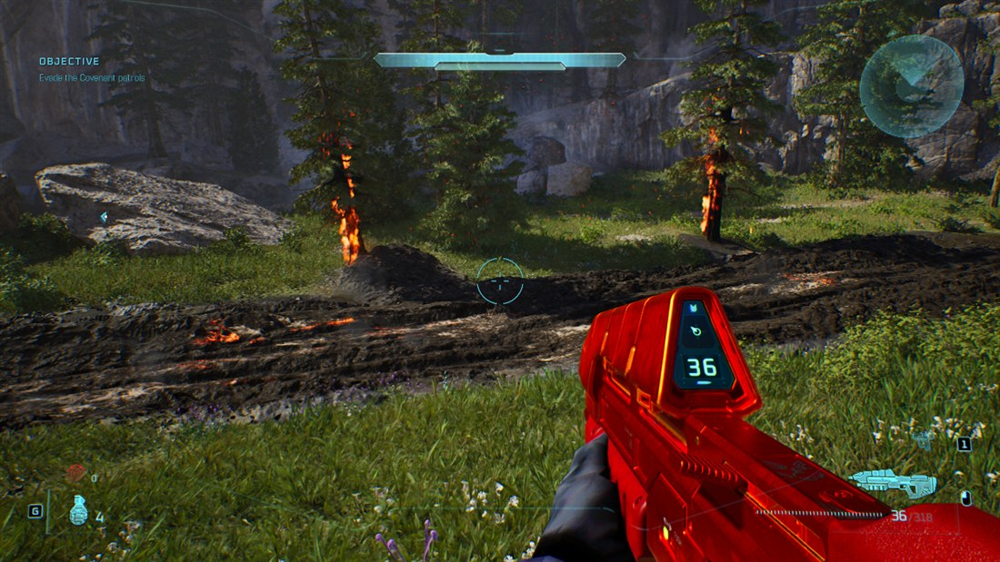

# Swapping a Texture

**Goal:** repaint something in the game and see it in your own hands
**Time:** about ten minutes, most of it spent painting
**You need:** Halo Campaign Evolved installed, and either the tag editor or the
`mjolnir` command line



That rifle is the shipped model, the shipped material and the shipped UVs. The only
thing that changed is the pixels in one `.ubulk` chunk — and the ammo counter still
reads correctly, which is the point: a swap moves nothing.

For *why* the cooked format looks the way it does, see
[`ue_texture_format.md`](ue_texture_format.md). This page is about using it.

---

## Two ways to do this

**The tag editor** is the shorter road, and the one to take if you are already
building a mod: a swap becomes part of your mod project alongside your tag
edits, so one *Test in game* covers all of it and one archive ships all of it.
Jump to [In the tag editor](#in-the-tag-editor).

**The command line** builds a standalone override container for one texture,
with nothing else attached. It is the better tool for trying something quickly
or for scripting a batch. That is the walkthrough in sections 1–5 below.

Both routes run the same encoder and the same safety checks — the editor calls
straight into the crate the CLI uses.

---

## Before you start

**Nothing shipped is ever modified.** `mjolnir texture swap` reads the installed
containers read-only and writes a *new* override container that you drop beside them.
Undoing a swap is deleting three files, and Steam's *Verify integrity of game files*
is the backstop.

Exported textures are **copyrighted game content**. Keep them local. Share the
override container only with people who own the game — and see
[`making_your_first_mod.md`](making_your_first_mod.md) for the archive format the hub
validates.

```powershell
$env:HCE_PAKS = "C:\Program Files (x86)\Steam\steamapps\common\Halo Campaign Evolved\Meteorite\Content\Paks"
```

An `oo2core_*_win64.dll` in `$env:OODLE` makes reading about four times faster but is
optional; without it the built-in decoder reads the same bytes.

## Why this works at all

A cooked texture's payload is a fixed jigsaw. A virtual texture is a set of
border-padded tiles at recorded offsets; a classic chain is mips concatenated in
order. Both are addressed by offsets stored in the `.uasset`.

The trick is that **re-encoding an image at the shipped dimensions and pixel format
produces a payload of exactly the shipped byte size.** DXT1 at 6144×1024 is 3,145,728
bytes whatever the picture is. So every offset the metadata holds stays valid, and a
swap is not a re-cook — it is *replace the bytes of one chunk*. For a virtual texture
the `.uasset` is not touched at all.

That is also why the swap survives a game update better than you might expect: it
addresses the chunk the game already asks for, by the ID read out of the shipped
index. If an update re-cooks the texture at a different size, the swap stops applying
rather than corrupting anything — rebuild it and it lines up again.

## 1. Find a texture

```bash
mjolnir texture list --filter AssaultRifle/default/Textures --detail
```

`--detail` reads each header and reports what is really there:

```
  6144x1024   PF_DXT1          virtual  12 mips  .../T_rifle_assaultrifle_default_D
 12288x2048   PF_BC5           virtual  12 mips  .../T_rifle_assaultrifle_default_N
  3072x512    PF_BC7           virtual  12 mips  .../T_rifle_assaultrifle_default_Masks
 12288x2048   PF_BC7           virtual  12 mips  .../T_rifle_assaultrifle_default_ORME
```

The suffix tells you what each map is for. `_D` is the albedo — the base colour, and
the one to change for a repaint. `_N` is the normal map (surface bumps), `_ORME` packs
occlusion/roughness/metalness/emissive into channels, and `_Masks` drives the
material's tinting. **Start with `_D`.** Editing `_N` or `_ORME` as if they were
pictures will make the surface behave strangely, because they are data, not images.

`mjolnir texture info --asset <substring>` prints the whole cooked layout when you want
to see it — tile grids, chunk sizes, where each mip lives.

## 2. Export it

```bash
mjolnir texture export --asset AssaultRifle/default/Textures/T_rifle_assaultrifle_default_D --out ar.png
```

`--asset` is a substring and it refuses an ambiguous one rather than guessing — the
bare name `T_rifle_assaultrifle_default_D` matches the `HP_Omen` skin too, so enough of
the path has to come along to single one out. The error lists the matches.

That writes the top mip as a PNG. It is an atlas: every part of the rifle laid out
flat, so an area you paint maps to wherever that area sits on the model.

## 3. Paint it

Any editor. The only rule that matters is **do not move anything** — paint over the
atlas, keep the layout. Moving a panel moves it on the gun.

Size is not a rule: the replacement is resampled to the shipped dimensions, so a
smaller image works (it will just be softer). Matching the exact size gives the
sharpest result.

The screenshot above was made by pushing the albedo's luminance through a warm ramp,
which recolours everything while keeping every panel line and decal — a good first
swap, because if the UVs are still right you can see it immediately.

## 4. Swap it

```bash
mjolnir texture swap --asset AssaultRifle/default/Textures/T_rifle_assaultrifle_default_D \
  --image ar.png --out-dir out --preview check.png
```

```
  shipped  6144x1024 PF_DXT1
  image    6144x1024 (exact)
  rewrote  12 mip(s), 3585176 of 4818220 payload bytes changed
  readback mean channel error 0.92 / 255
```

Every mip is regenerated, not just the top one — otherwise the rifle would revert to
its shipped colours as you backed away from it.

**Read the `readback` line.** The command decodes the payload it just wrote and
compares it against the image that went in. Block compression costs a couple of levels;
a tile written to the wrong offset costs dozens. Anything above 12 fails the command
rather than shipping a corrupt asset. `--preview` writes that decode out as a PNG so
you can look at it yourself.

## 5. Test it in game

Copy the three files into your Paks folder:

```bash
cp out/pakchunk999-MJOLNIR-texture_P.* "$HCE_PAKS/"
```

`pakchunk999` mounts after everything shipped, and the `_P` suffix makes it a patch
container — that is what wins the chunk lookup. The `.pak` is a discovery stub; a
container without one is never mounted. Then launch the game and go look at the thing
you painted.

To undo it, delete those three files. That is the whole uninstall.

## In the tag editor

The editor treats a repaint as one more thing a mod changes, next to its tag
edits and scripts. There is no separate container to manage and nothing to copy
by hand.

1. **Open or create a mod project** in the MOD panel. A swap has to be saved
   somewhere, so *Replace…* stays greyed out until a project is open — the
   button's tooltip says which of the two reasons is stopping it.
2. **Open the texture**, from the TEXTURES list or by walking to it in FILES.
3. **Export PNG…** to get the shipped atlas, and paint it exactly as in
   [section 3](#3-paint-it) — same rules, same atlas, same warning about moving
   things around.
4. **Replace…** and pick your PNG. The editor re-encodes every mip, checks the
   payload came out the same length, and decodes it back to compare against
   what you handed it. On a large virtual texture this takes a few seconds.

What you see afterwards is the *readback* — the payload decoded again, which is
what the game will really draw, block-compression losses and all — with the
same numbers the CLI prints:

> This mod replaces this texture. Re-encoded 12 mips; 4,180,992 of 4,818,220
> payload bytes changed; readback error 2.41 / 255.

The swap now appears in the mod's change list, and *Test in game* and *Export
.mjolnir archive* bake it along with everything else. **Revert** in the texture
header drops it.

Your PNG is stored in the project folder at `textures/<path>.png`, and
`edits.json` records which textures have one — the same arrangement as `.hsc`
script files. That means the recipe stays readable and re-encodes against
whatever the player's install ships, so a game update does not bake a stale
payload into your mod. It also means the PNG is the file under version control,
not a cooked blob.

## What can be swapped

| Format | |
|---|---|
| `PF_DXT1`, `PF_DXT3`, `PF_DXT5` | yes |
| `PF_BC4`, `PF_BC5` | yes |
| `PF_B8G8R8A8`, `PF_G8`, `PF_A8` | yes |
| `PF_BC7`, `PF_BC6H` | **not yet** — needs a BPTC encoder |

Both virtual textures and classic mip chains are supported. `PF_BC7` is a real gap:
it is the second most common format in the game (1209 textures, against DXT1's 1867),
and it covers most `_ORME` and `_Masks` maps. Albedo maps are usually DXT1 or DXT5,
which is why repaints work today.

Refused rather than approximated, in both cases:

- **A format with no encoder** fails the command. A texture written in a format we
  encode wrongly would be a corrupt asset in a player's install, showing up as garbage
  pixels rather than an error.
- **Cubemaps, arrays and volume textures** fail too. One 2D image does not say what the
  other faces should become, and rewriting one would silently discard them.
- A classic texture that keeps **every** mip inline in its export has no bulk chunk to
  replace; the encoder handles it, but neither the command nor the editor can pack it
  yet.

In the editor, an unsupported format is visible before you pick a file: *Replace…*
is greyed out and the reason sits under the texture's path.

## Troubleshooting

**Nothing changed in game.** Check the file names first — the `_P` suffix and the
`.pak` stub are both load-bearing, and a `pakchunk` number below a shipped one loses.
Close the game before copying: Windows will not let files it holds open be replaced,
so a silent copy failure looks exactly like a swap that did nothing.

If the files are right, re-run `texture swap` and read the `chunk id` line — that is
the chunk your container claims. It has to be the asset you meant.

**It changed, but the wrong thing.** The game ships several skins per weapon under
sibling folders (`default/`, `AssaultRifle_HP_Omen/`, `AssaultRifle_Twitch/`, …). Check
you repainted the one the game actually equips.

**The colours are close but not right.** Albedo maps are usually multiplied by material
tinting, which is often driven by `_Masks`. The rifle above reads redder in game than
its atlas does for exactly this reason. Paint to taste against the in-game result, not
the PNG.

**`readback mean channel error` is high.** That is the swap refusing to ship something
broken. It means the payload did not decode back to the image that went in, which is a
bug worth reporting with the asset path.

---

Questions, or something here did not match what you saw? Say so on the Discord — this
path is new and reports make it better.
